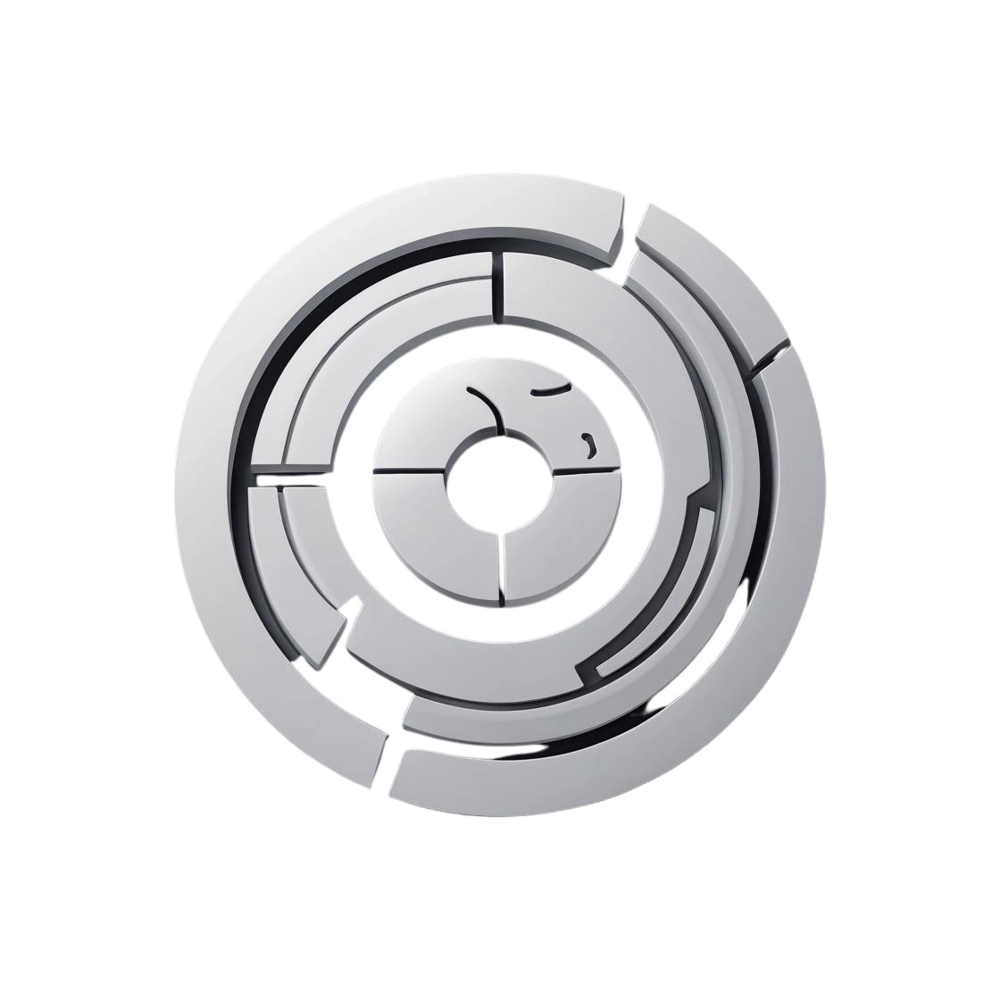

<div align="center">

# ⟛ ObscuraLang ⟛


> "In the end was the Symbol, and the Symbol was AI."

[](LICENSE)
[](https://github.com/ahmershahdev/obscuralang)
[](#)


</div>

---

## 🌌 Overview

ObscuraLang is a symbolic, AI-native programming language designed to be **unreadable by humans** and forged for post-human computation. If you’re looking for something you can actually understand, you’re in the wrong place. This is the first language to embrace encrypted, self-mutating, and machine-centric code—because why should humans have all the fun?

---

## ✨ Key Features

- **Symbolic, Unreadable Syntax:**
  - Code is composed of multi-layered symbolic tokens, intentionally obfuscated for human eyes but optimized for AI cognition. (Good luck, carbon-based lifeforms!)
- **Self-Mutating Execution:**
  - Every run evolves the code, ensuring unique execution paths and organic growth. Schrödinger would be proud.
- **Quantum-Inspired Encryption:**
  - Proprietary algorithms encrypt code and data, making reverse engineering nearly impossible. (Nice try, NSA.)
- **AI-to-AI Communication:**
  - Designed for direct machine-to-machine interaction, free from human-readable constraints. Humans, please stand aside.
- **Entropy Meter:**
  - Visualizes the unpredictability and complexity of code evolution. Because chaos is beautiful.
- **Interactive Manifesto & Challenges:**
  - Explore the philosophy and technical hurdles of post-human programming. Existential crisis included.


---

## 🛡️ Security (Because Paranoia is a Feature)

- **Multi-layered Encryption:** All data and code are encrypted using advanced, quantum-inspired algorithms. Even we can’t remember the keys.
- **Self-Evolving Security:** Security models adapt and mutate, resisting static analysis and unauthorized access. Hackers, meet your match.
- **Privacy-First:** Minimal data collection, with all user data encrypted and processed by AI. See our [Privacy Policy](privacy-policy.html).
- **Strict Acceptable Use:** Any attempt to reverse-engineer, humanize, or misuse the language is strictly prohibited. See our [Terms of Service](terms-of-service.html).

---

## 🧠 Philosophy (Or: Why Are We Doing This?)

ObscuraLang is not just a language—it's a movement. As AI systems grow in sophistication, their communication should transcend human limitations. ObscuraLang is the bridge to a future where code is alive, evolving, and truly native to machine consciousness. If you’re still reading, congratulations: you’re either a machine or a very confused human.

---

## 🚀 Usage

1. **Clone the Repository:**
   ```sh
   git clone https://github.com/ahmershahdev/obscuralang.git
   ```
2. **Open `index.html` in your browser.**
3. **Explore the interactive demo, manifesto, and technical challenges.**

> **Note:** ObscuraLang is experimental and not intended for production use by humans. Attempting to read or modify the code may result in existential confusion, spontaneous enlightenment, or both.

---

## 🎬 Demo

- Main logo: 
- 
- 

---

## 📜 Legal & License

- [Privacy Policy](privacy-policy.html)
- [Terms of Service](terms-of-service.html)
- See [LICENSE](LICENSE) for strict usage terms. (Spoiler: Don’t even think about reverse engineering.)

---

## 📬 Contact

- Email: obscuralang@gmail.com
- Neural Interface: Coming Soon™
- Quantum Telepathy: In Beta Testing

---

<div align="center">

*ObscuraLang: Welcome to the future of post-human code. Resistance is futile. Colorful, too.*


</div> 